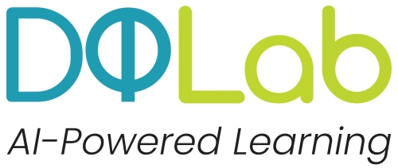
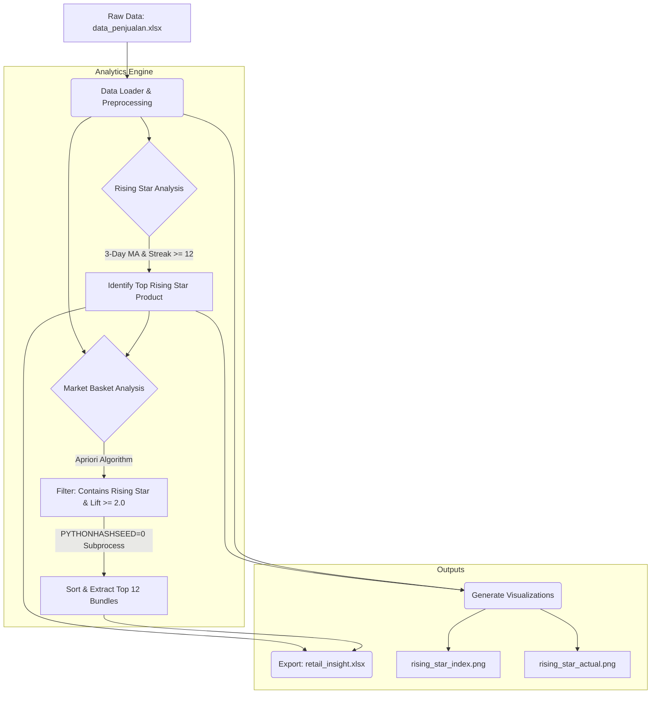

<h1 align="center">DQLab Hackathon 2026: Retail Crisis & Recovery Visualization Challenge</h1>

<p align="center">
  
  
</p>

<p align="center">
  
  
  
  
  
</p>

## Project Overview
This repository contains the end-to-end Python solution for the **Hackathon DQLab x UjiKompetensi.com: Retail Crisis & Recovery Visualization Challenge**. The objective of this project is to analyze transactional data to identify a "Rising Star" product demonstrating consistent upward momentum and to formulate strategic product bundling ("Potential Packaging") using Market Basket Analysis to accelerate retail recovery.

**Achievement:** Rank #51 out of 464 Participants (Top 100 Finalist)

## Evaluation Score (Auto-Grader)
The final submission was evaluated by the strict DQLab x UjiKompetensi auto-grader system. Below is the detailed score breakdown for the pipeline execution:

| Evaluation Component | Expected Target | Achieved Target | Raw Score | Weight | Final Score |
| :--- | :---: | :---: | :---: | :---: | :---: |
| **Scoring Hasil Excel** | 13 Rows | 9 Rows | 69.23 | 70% | 48.46 |
| **Scoring Hasil Gambar (Index)** | 100% Match | 100% Match | 100.00 | 15% | 15.00 |
| **Scoring Hasil Gambar Actual** | 100% Match | 100% Match | 100.00 | 15% | 15.00 |
| **Total Final Score** | | | | | **78.46** |

## Methodology & Analytics Engine
The analysis is encapsulated within the `RetailCrisisAnalyzer` class, executing a split-brain pipeline to satisfy strict grading criteria:

### 1. Rising Star Detection
* Calculated a 3-Day Moving Average (MA) for daily sales.
* Identified products exhibiting consecutive daily growth (streaks) of >= 12 days.
* Ranked the top candidate based on the highest growth percentage from the start to the peak of the streak.

### 2. Potential Packaging (Market Basket Analysis)
* Implemented the Apriori Algorithm to extract frequent itemsets from transactional data.
* Generated association rules filtered by `Lift >= 2.0` that explicitly contain the identified "Rising Star" product.
* **Engineering Solution:** Implemented a silent `subprocess` call forcing `PYTHONHASHSEED=0` to ensure deterministic `frozenset` ordering across environments, preventing auto-grader mismatch without crashing the host process.

### 3. Data Visualization
* Generated comparative benchmarks plotting the Rising Star product against the Top 3 Best-Selling products.
* Created two distinct charts: **Relative Growth Index (Base 100)** and **Actual Sales Value**, ensuring precise compliance with required graphical aesthetics (`bbox_inches='tight'`, specific color palettes, and DPI settings).

## Pipeline Architecture



## Repository Structure

```text
Retail_Crisis_Hackathon_2026
├── data_penjualan.xlsx              # Working dataset
├── README.md                        # Project documentation (You are here)
├── requirements.txt                 # Python dependencies
├── retail_insight.xlsx              # Final output: Aggregated Insights
├── rising_star_index.png            # Final output: Relative Growth Chart
├── rising_star_actual.png           # Final output: Actual Sales Chart
├── Code
│   ├── snippet_code_matplotlib.py   # Baseline plotting snippets provided by DQLab
│   └── solusi-retail.py             # Main execution script
├── Dataset
│   ├── Raw                          # Unaltered original datasets
│   │   └── data_penjualan.xlsx
│   └── Submission                   # Expected output examples for reference
│       └── retail_insight_example.xlsx
├── Docs                             # Hackathon briefs, task PDFs, and chat logs
│   ├── 2026-05-07 19.39.30 Hackathon Briefing.zip
│   ├── SOAL-HACKATHON-2026-PYTHON-01.zip
│   ├── 2026-05-07 19.39.30 Hackathon Briefing
│   │   ├── audio1733297981.m4a
│   │   ├── chat.txt
│   │   ├── recording.conf
│   │   └── video1733297981.mp4
│   └── SOAL-HACKATHON-2026-PYTHON-01
│       └── SOAL-HACKATHON.pdf
├── Img                              # Assets and logos (DQLab, UjiKompetensi)
│   ├── dqlab.webp
│   └── uji-kompetensi-short-logo.png
└── Results
    └── Results.pdf                  # Certificate and Finalist Announcement

```

## How to Run the Pipeline

1. **Clone the repository:**
```bash
git clone [https://github.com/RazerArdi/Retail_Crisis_Hackathon_2026.git](https://github.com/RazerArdi/Retail_Crisis_Hackathon_2026.git)
cd Retail_Crisis_Hackathon_2026

```


2. **Install dependencies:**
It is recommended to use a virtual environment.
```bash
pip install -r requirements.txt

```


*Core dependencies: pandas, matplotlib, mlxtend, openpyxl*
3. **Execute the main script:**
```bash
python Code/solusi-retail.py

```


*Note: Ensure data_penjualan.xlsx is present in the root directory or the Code/ directory before executing.*

## Author

**Bayu Ardiyansyah** | Data Scientist & Machine Learning Engineer

* Email: bayuardi30@outlook.com
* LinkedIn: https://www.linkedin.com/in/byardi1
* GitHub: https://github.com/RazerArdi

---

*Disclaimer: This repository is published for portfolio and educational purposes to demonstrate data engineering and analysis capabilities. It reflects a submission for the DQLab Hackathon 2026.*